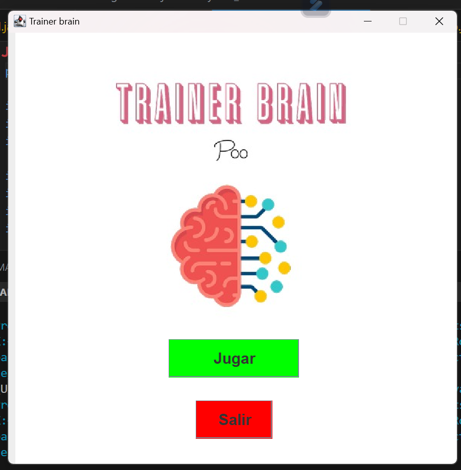
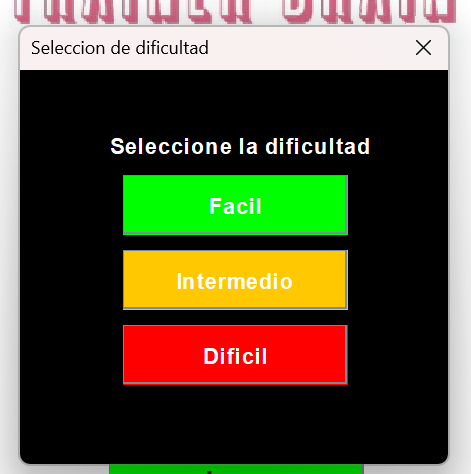
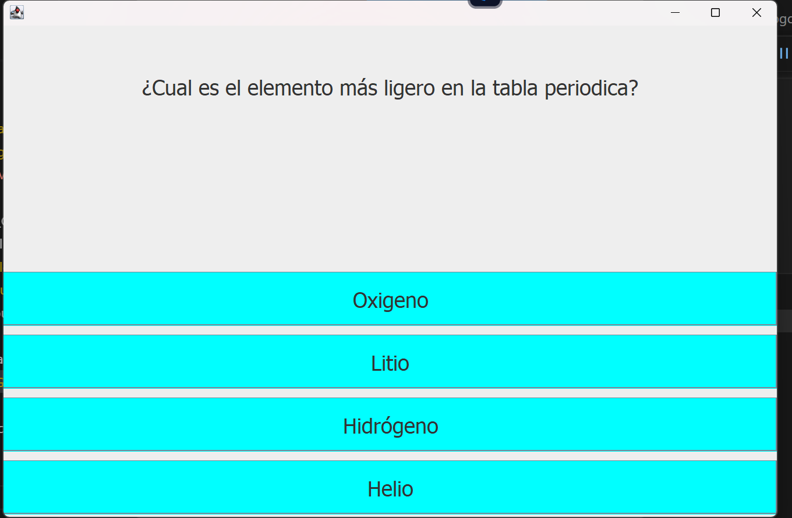
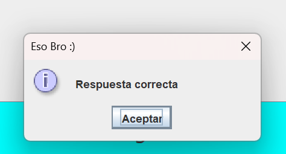
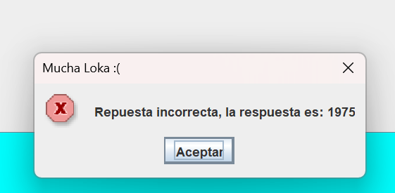
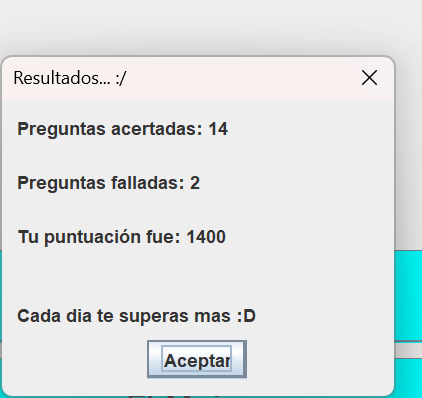

# Proyecto_POO1
## Descripción del problema
Hoy en día los jóvenes han perdido gran parte del conocimiento que tienen acerca del mundo debido a diversos factores actuales, que han venido afectando a la juventud quitando ciertas costumbres por enriquecer el conocimiento y solo dejar lo necesario para sobrevivir y no buscar el progreso tanto personal como social. Como dijo Irene Hernández (2020) “Las causas también están claramente identificadas: disminución en la calidad y cantidad de interacciones intrafamiliares, que son fundamentales para el desarrollo del lenguaje y el desarrollo emocional; disminución del tiempo dedicado a otras actividades más enriquecedoras (tareas, música, arte, lectura, etc.)”  (Especial para BBC News Mundo). Al final las tecnologías nos han encerrado en un mundo que el que tenga más fama más nos aporta, cuando todo aquello que podemos considerar alimento para el conocimiento lo podemos encontrar en la palma de nuestra mano.
En un nuestro caso, más específicamente en América latina este problema es mucho mayor, debido a que, en comparación con países desarrollados de Europa o norte América, nosotros no poseemos un gran avance tecnológico por una gran parte de la población no puede acceder a internet o siquiera a una educación básica para asi empezar con su adquisición de conocimientos.
En nuestro país en muchas zonas esto es muy evidente, como lo son las zonas de alta pobreza que hay a lo largo del país (como en Bogotá, Medellín o la guajira), pero no es un problema de única índole social, sino también en el caso de nuestra nación muchas veces las grandes empresas y la política solo se centran en la adquisición de recursos antes que buscar que la sociedad en general adquiera conocimientos para asi tener un mayor progreso.
Pero si nos enfocamos en aquellos que si poseen los recursos para conseguir todo el conocimiento que quieran no lo hacen, debido a como dije anteriormente porque solo se centran en el entretenimiento que le puede llegar a brindar su teléfono y no todas las capacidades informáticas de este mismo, por eso este grupo de personas va a ser nuestro eje de estudio y por el cual queremos desarrollar este programa.
La principal causa de todo esto si nos vamos ya a un punto más informático es debido al algoritmo de las redes/páginas que usan los usuarios. Tampoco es un gran fundamento culpar al algoritmo ya que el solo sigue la orden de recomendar lo que al usuario le satisfaga y si ese contenido es poco cultural, él por órdenes del código lo seguirá haciendo. Los causantes de todo esto somos nosotros mismo al no saber controlar el acceso que tenemos a los aparatos y más este tipo de redes que solo nos sirven como medio de entretenimiento.
Si esto se sigue presentando la principal consecuencia que tendremos será que nosotros como sociedad cada día estaremos más atrasada sin darnos cuenta como nuestro mundo cambia, pero no somos participes de este cambio. Al final por esto mismo nuestro país seguirá siendo solo un punto de mercado mas no un exponente en casi ningún ámbito porque a pesar de todo las mentes más brillantes logran que su nación tenga un gran reconocimiento.
Nuestra idea es crear un programa que haga preguntas de diversa índole y asi la gente a su vez que se divierte pueda adquirir conocimiento y asi poder empezar a solucionar este problema desde el ámbito que lo provoca que es el entretenimiento. Todo esto con el fin de que asi sea todos nos lleguemos a interesar por cualquiera que sea el ámbito del conocimiento, ya sea historia, arte, ciencia, etc. Además, las personas no perderán el interés por este ya que al ser una actividad didáctica volver a repetirla en diferentes ocasiones.
## Diagrama de clases

## Interfaz gráfica Y Como Funciona el programa.
-------------
### Interfaz gráfica

### Niveles de dificultad

### Preguntas

### Respuesta Correcta

### Respuesta Incorrecta

### Tabla de Resultados

